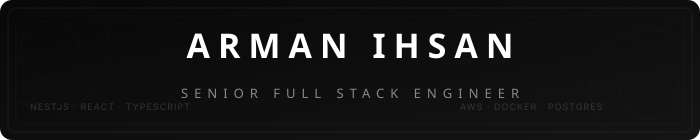
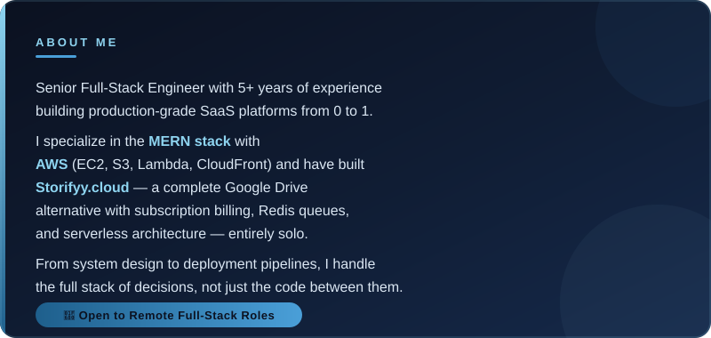
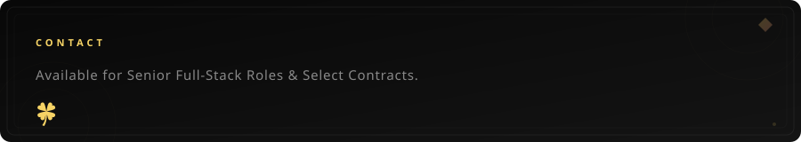

 

### Socials

 

<!-- HEADER: INTERFACE ENGINEERING -->

 

<!-- HEADER: SYSTEMS LOGIC -->

 

<!-- HEADER: AUTH & IDENTITY -->

 

<!-- HEADER: INFRASTRUCTURE -->

 

<!-- HEADER: OBSERVABILITY -->

 

<!-- HEADER: TOOLS -->

 

